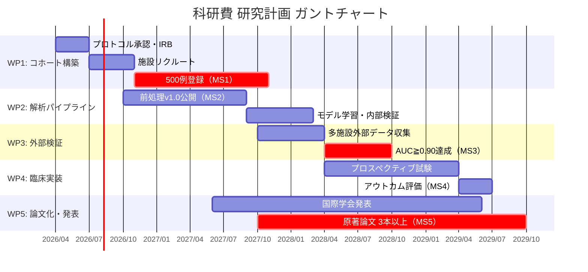

# 23. ガントチャート（Mermaid）

> 22 で確定したマイルストーンを Mermaid gantt 記法で表現する。
> ユーザーに描画させて確認 → 修正ラリー → 合意までクローズしない。

## Mermaid gantt（テンプレート）

## ユーザー確認チェックリスト

- [ ] 各WPの順序関係が論理的か
- [ ] MS（数値マイルストーン）が `:crit,` でハイライトされているか
- [ ] 期間が研究期間に収まっているか
- [ ] バッファ期間（最後3〜6ヶ月）が確保されているか

## 修正履歴

| 日付 | 修正内容 | 反映済み |
|------|---------|---------|
|  |  | ☐ |
|  |  | ☐ |
